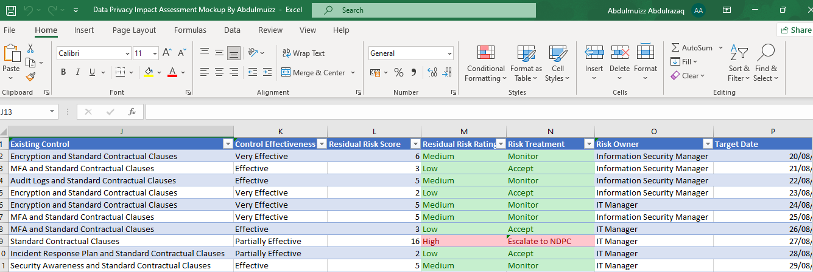
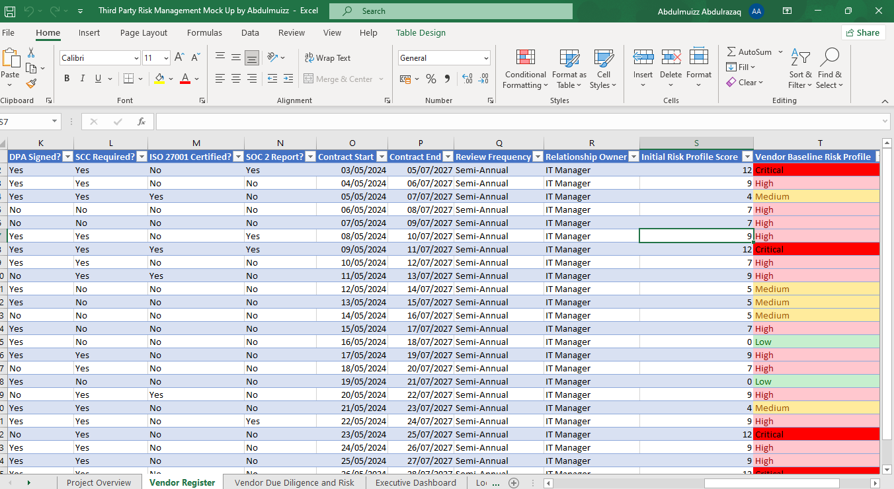

**Project Scenerio**

HealthBridge is expanding its digital healthcare platform and has engaged several third-party vendors.

Some vendors process personal data.

Some provide cloud infrastructure.

Some have access to sensitive medical information.

Some provide payment services.

Some merely provide office supplies.

The organization must determine:

Which vendors pose the highest risk?
Which vendors require enhanced due diligence?
Which vendors need annual reassessment?
Which vendors require Data Processing Agreements (DPAs)?
Which vendors require SCCs because they transfer personal data internationally?

**Project Overview**

This workbook is a practical simulation of a Third-Party Risk Management (TPRM) system developed using Microsoft Excel. It demonstrates how organizations identify, assess, monitor, and manage risks arising from vendors, suppliers, service providers, and other third parties throughout the vendor lifecycle.

The workbook enables organizations to maintain a centralized vendor register, conduct vendor due diligence, evaluate inherent and residual risks, monitor contractual and regulatory obligations, assess privacy and cybersecurity controls, manage cross-border data transfer risks, and track remediation activities.

The project reflects industry best practices for governance, risk, compliance, information security, and data protection.

**Project Objectives**

Maintain a centralized vendor inventory.
Perform vendor due diligence assessments.
Assess vendor criticality and inherent risk.
Evaluate privacy, cybersecurity, operational, financial, legal, and geographical risks.
Automate vendor risk scoring.
Track mitigation activities.
Monitor vendor performance and contract reviews.
Produce executive-level risk dashboards.

**Risk Domains Assessed**

Information Security
Data Privacy
Cybersecurity
Operational Risk
Financial Risk
Legal & Regulatory Risk
Geographic Risk
Fourth-Party Risk
Business Continuity & Disaster Recovery
Vendor Governance

**Expected Outcomes**

Upon completion, this workbook provides:	
	
A centralized vendor inventory.	
Automated vendor risk classification.	
Due diligence tracking.	
Privacy and cybersecurity oversight.	
Overall Recommendation	
Executive reporting through an interactive dashboard.	

## Privacy Risk Assessment

## Vendor Register

